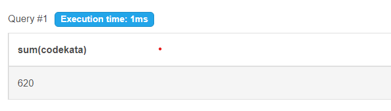
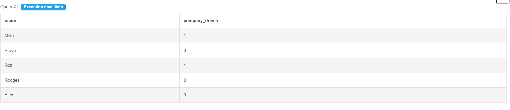
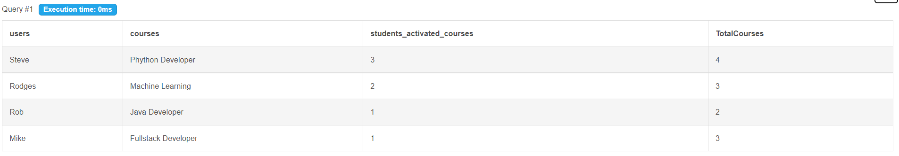
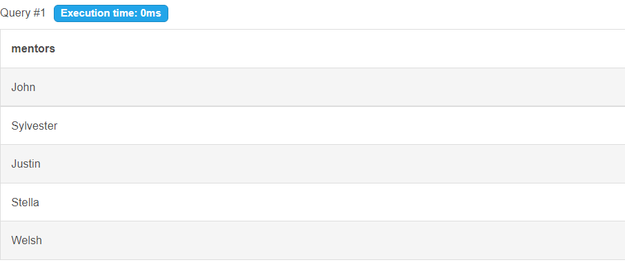
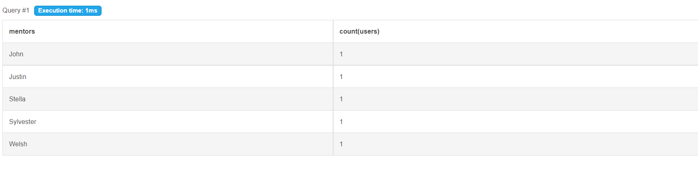

# sql_task1

The Following are the tables has to be in your database & model deisgn:
users
codekata
attendance
topics
tasks
company_drives
mentors
students_activated_courses
courses

The following are the queries need to be executed

1. Create tables for the above list given

CREATE TABLE DataBase
(users varchar(50),codekata integer,attendance integer,topics integer,tasks integer,company_drives integer,mentors varchar(50), students_activated_courses integer,courses varchar(50));

2. insert at least 5 rows of values in each table
INSERT INTO DataBase (users,codekata,attendance,topics,tasks,company_drives,mentors,students_activated_courses,courses) 
VALUES 
("Mike",170,10,10,15,1,"John",1,"Fullstack Developer"), ("Steve",80,15,15,22,0,"Sylvester",3,"Phython Developer"), ("Rob",100,22,24,18,1,"Justin",1,"Java Developer"), ("Rodges",120,30,16,15,0,"Stella",2,"Machine Learning"), ("Alex",150,20,28,19,0,"Welsh",1,"Fullstack Developer"); 

3. get number problems solved in codekata by combining the users
SELECT sum(codekata) FROM DataBase;
  

4. display the no of company drives attended by a user
SELECT users,company_drives FROM DataBase;
  

5. combine and display students_activated_courses and courses for a specific user groping them based on the course
SELECT users,courses,students_activated_courses,
(count(courses) + students_activated_courses) as TotalCourses
FROM DataBase 
group by courses 
order by  users desc;
  

6. list all the mentors
SELECT mentors FROM DataBase;
  

7. list the number of students that are assigned for a mentor
SELECT mentors, count(users) FROM DataBase group by mentors;
  
